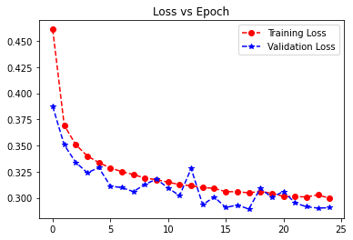
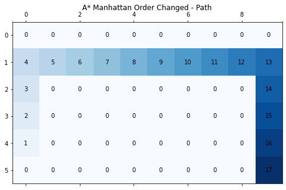
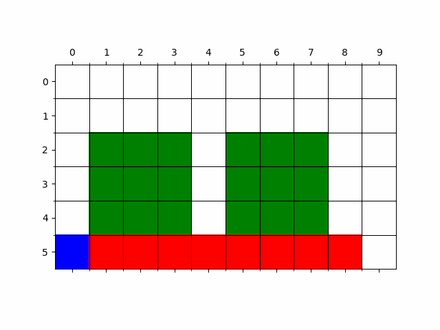

# ArtificialIntelligence

## 101 - Machine Learning Basics

### Boston Housing Dataset

#### Heatmap

  

### Linear Regression

|   LinearRegression   | DatasetType |  RMSE   |    R2    |
|:--------------------:|:-----------:|:-------:|:--------:|
| sklearn.linear_model |    Train    | 5.29127 | 0.649317 |
|                      |    Test     | 6.04104 | 0.616202 |
|     Implemented      |    Train    | 5.29128 | 0.649316 |
|                      |    Test     | 6.03568 | 0.616883 |

### Titanic Dataset

#### Heatmap

  

#### P-Class Boxplot for Age Missing Data

  

### Logistic Regression

|  LogisticRegression  | DatasetType | Accuracy | Precision | Recall | F1-Score |
|:--------------------:|:-----------:|:--------:|:---------:|:------:|:--------:|
| sklearn.linear_model |    Train    |  0.802   |   0.771   | 0.677  |  0.721   |
|                      |    Test     |  0.809   |   0.863   | 0.620  |  0.721   |
|     Implemented      |    Train    |  0.812   |   0.773   | 0.710  |  0.740   |
|                      |    Test     |  0.815   |   0.839   | 0.662  |  0.740   |

## 102 - Neural Networks and Deep Learning

### CNN - Vertical Filter for Edge Detection

  

### CNN - Horizontal Filter for Edge Detection

  

### simpleCNN - Fashion MNIST Dataset

  

    
  

  

    
  

### LeNet-5 - Fashion MNIST Dataset

  

    
  

  

    
  

## 103 - Cliff Walking

### Informed Search

|     |                                  Trajectory                                  |                                  Path                                  |                           Order Changed Trajectory                           | Order Changed Path                                                     |
|-----|:----------------------------------------------------------------------------:|:----------------------------------------------------------------------:|:----------------------------------------------------------------------------:|------------------------------------------------------------------------|
| DFS |  |  |  |  |
| BFS |  |  |  |  |
| UCS |  |  |  |  |

### Uninformed Search

|                  |                                       Trajectory                                       |                                       Path                                       |                                Order Changed Trajectory                                | Order Changed Path                                                               |
|------------------|:--------------------------------------------------------------------------------------:|:--------------------------------------------------------------------------------:|:--------------------------------------------------------------------------------------:|----------------------------------------------------------------------------------|
| Greedy Manhattan |  |  |  |  |
| Greedy Euclidean |  |  |  |  |
| A* Manhattan     |   |   |   |   |
| A* Euclidean     |   |   |   |   |

## 104 - Minimax Search

### Without Alpha-Beta Pruning

  

### With Alpha-Beta Pruning

  

## 105 - Reinforcement Learning

### 105.1 - Deep Q Learning - Value Iteration

### 105.2 - Actor Critic

## 106 - Twitter Sentiment Analysis Using RNN

# Project -

## Image Classification Deep Convolutional Neural Networks

## Reinforcement Learning for Autonomous Driving (In - Progress)
